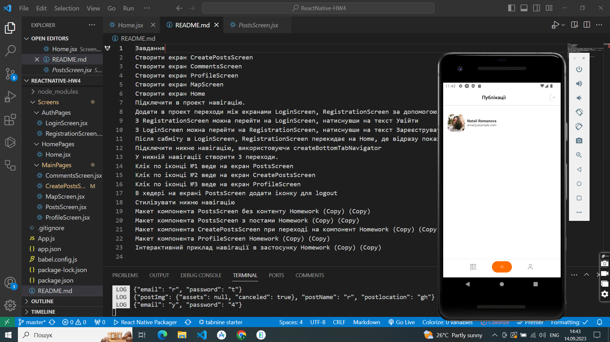
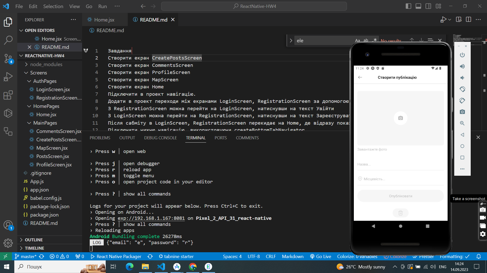

Завдання​
Створити екран CreatePostsScreen
Створити екран CommentsScreen
Створити екран ProfileScreen
Створити екран MapScreen
Створити екран Home
Підключити в проект навігацію.
Додати в проект переходи між екранами LoginScreen, RegistrationScreen за допомогою компонента createStackNavigator
З RegistrationScreen можна перейти на LoginScreen, натиснувши на текст Увійти
З LoginScreen можна перейти на RegistrationScreen, натиснувши на текст Зареєструватися
Після сабміту в LoginScreen, RegistrationScreen перекидає на Home, де відразу показується екран PostsScreen
Підключити нижню навігацію, використовуючи createBottomTabNavigator
У нижній навігації створити 3 переходи.
Клік по іконці №1 веде на екран PostsScreen
Клік по іконці №2 веде на екран CreatePostsScreen
Клік по іконці №3 веде на екран ProfileScreen
В хедері на екрані PostsScreen додати іконку для logout
Стилізувати нижню навігацію
Макет компонента PostsScreen без контенту Homework (Copy) (Copy)
Макет компонента PostsScreen з постами Homework (Copy) (Copy)
Макет компонента CreatePostsScreen при переході на компонент Homework (Copy) (Copy)
Макет компонента ProfileScreen Homework (Copy) (Copy)
Інтерактивний приклад навігації в застосунку Homework (Copy) (Copy)

<video src="assets/screenshots/14.09.2023_14.49.47_REC.mp4" controls title="Title"></video>
